# 管理员模块流程图和类图

## 图片格式说明

本文档包含的流程图和类图使用Mermaid语法编写，可以通过以下方式生成图片：

### 方法1：在线生成图片
1. 访问 [Mermaid Live Editor](https://mermaid.live/)
2. 复制下面的Mermaid代码到编辑器
3. 点击"Download PNG"或"Download SVG"下载图片

### 方法2：使用VS Code插件
1. 安装"Mermaid Preview"插件
2. 在VS Code中打开此文件
3. 使用Ctrl+Shift+P，搜索"Mermaid: Preview"
4. 右键点击预览图，选择"Save as Image"

### 方法3：使用命令行工具
```bash
npm install -g @mermaid-js/mermaid-cli
mmdc -i input.md -o output.png
```

---

## 1. 导入学生/教师信息模块

### 流程图
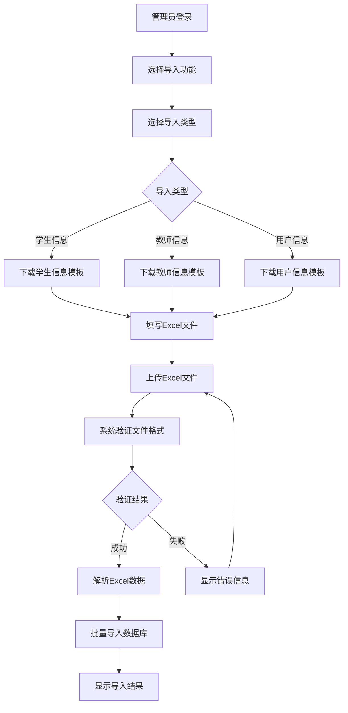

### 类图
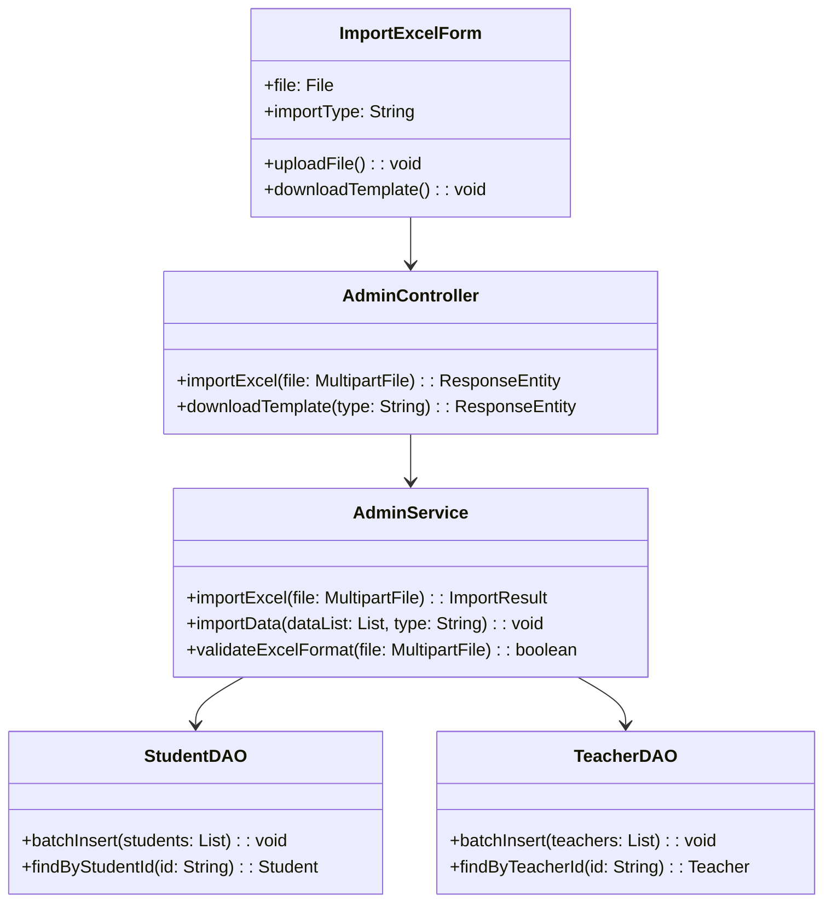

## 2. 学生分配模块

### 流程图
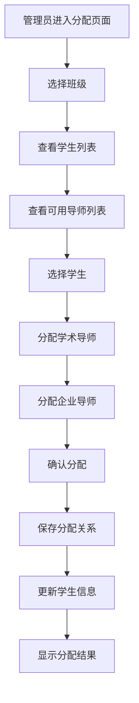

### 类图
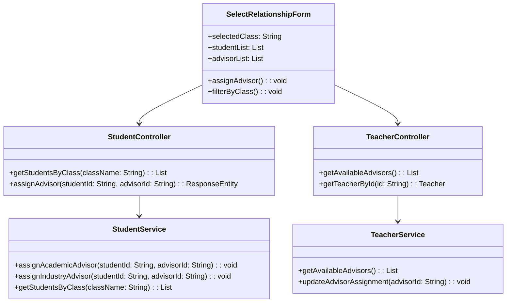

## 3. 企业信息审核模块

### 流程图
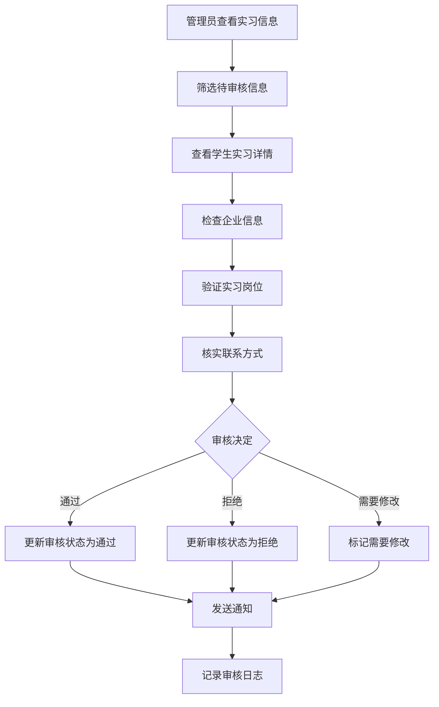

### 类图
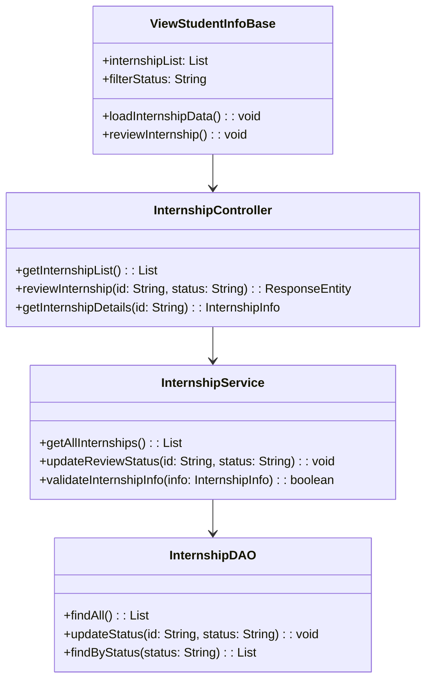

## 4. 学生成绩查看模块

### 流程图
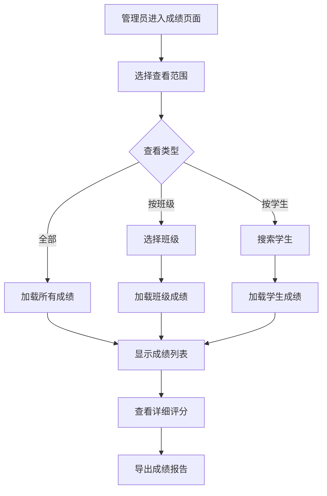

### 类图
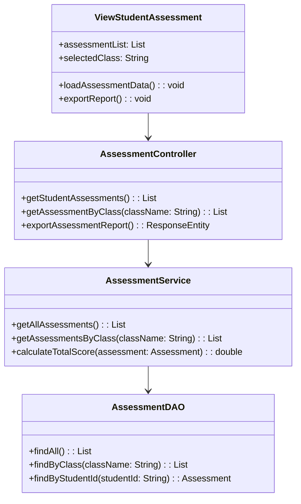

## 5. 学生周记管理模块

### 流程图
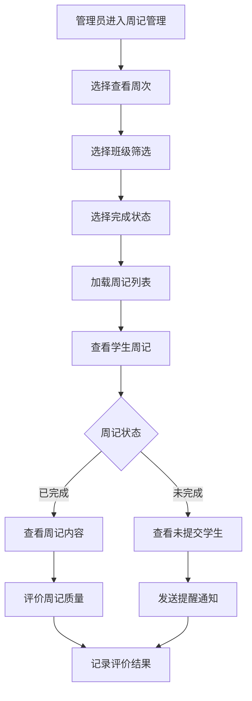

### 类图
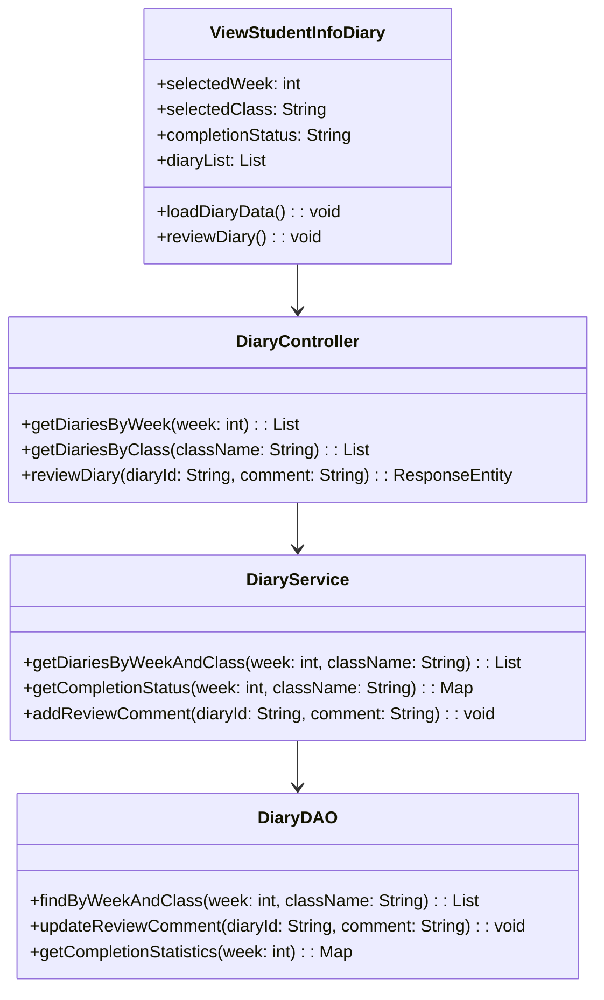

## 6. 报告下载模块

### 流程图
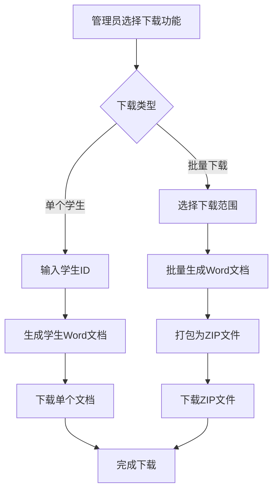

### 类图
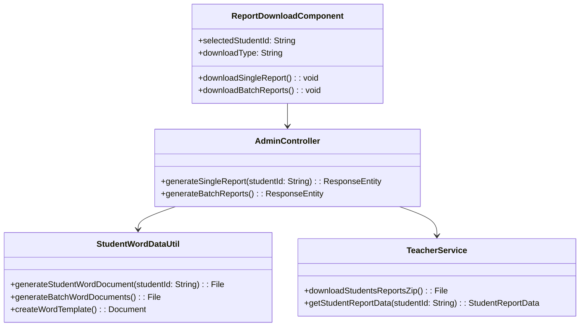

## 总体架构图

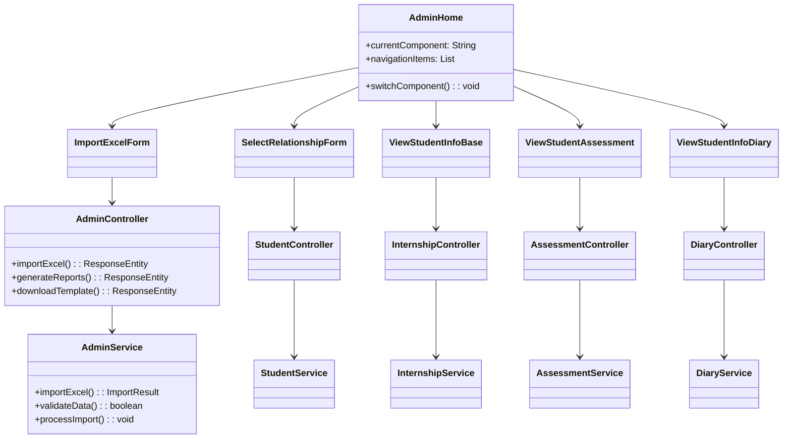